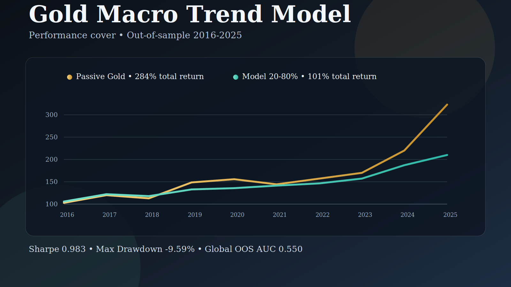

# Gold Macro Trend Model

> **A machine-learning pipeline that reads the macroeconomic environment and translates it into a quantified gold allocation — telling you not just whether to own gold, but how much.**

[](https://www.python.org/)
[](https://lightgbm.readthedocs.io/)
[](https://scikit-learn.org/)
[](LICENSE)
[]()
[]()



---

## What This Is

Gold is one of the most macro-sensitive assets in the world — driven by real interest rates, dollar strength, central bank demand, and inflation regimes. Yet most approaches to positioning in gold rely on simple moving averages or gut feel.

This project builds a **calibrated, walk-forward-validated ML model** that ingests 67 macroeconomic features across 9 thematic groups, produces a probabilistic conviction score (0–100), and maps it to a concrete portfolio allocation recommendation.

The model operates on **3–6 month horizons**, where macro forces dominate over short-term noise. It is designed for **portfolio allocation decisions**, not trading.

Key design principles:
- **No forward-looking features** — strict lookahead-bias prevention; every feature uses only data available at prediction time
- **Walk-forward validation** — 10 expanding-window folds (2016–2025), the gold standard for time series model validation
- **Calibrated probabilities** — Platt scaling ensures outputs are true probabilities, not raw model scores
- **Explainability** — 9 interpretable thematic factor groups; feature importance tracked across all folds

---

## Current Signal

> *Last computed: 2026-02-13 — refreshed every Monday*

| Composite Score | Direction | Prob (12w) | Prob (16w) | Prob (26w) |
|:-:|:-:|:-:|:-:|:-:|
| **69.5 / 100** | 🟢 **LONG** | 59.4% | **69.8%** | 78.9% |

**Score thresholds:** `LONG > 65` · `FLAT 35–65` · `SHORT < 35`

The current score of **69.5** maps to a recommended gold allocation of **~79%** (see allocation formula below).

```bash
# Refresh the signal with the latest market data
python -m src.pipeline.update_pipeline
```

---

## How to Use the Signal

### The Core Insight: Score as Allocation Slider

The model outputs a score between 0 and 100. Rather than treating this as a binary on/off switch, the optimal use is to map it **continuously** to a gold allocation percentage.

Over 10 years of out-of-sample data (2016–2025), the score ranged from **55.3 to 69.5** — it never issued a SHORT signal, and never dropped below 55. This means the macro environment for gold ranged from *neutral* to *strongly positive*. The rational response is to always maintain some exposure and scale it with conviction.

### Allocation Formula

$$\text{Gold allocation} = 20\% + \frac{\text{score} - 55}{70 - 55} \times 60\%$$

| Score | Allocation | Macro Interpretation |
|:-----:|:----------:|:---------------------|
| 55.0 | **20%** | Macro neutral — maintain minimum exposure |
| 60.0 | **40%** | Macro mildly positive |
| 62.5 | **50%** | Moderate conviction |
| 67.0 | **68%** | Strong macro tailwinds |
| **69.5** | **~79%** | **Current signal** — macro strongly positive |
| 70.0 | **80%** | Maximum allocation |

**Rebalance monthly** (not weekly). The model generates approximately **1–2 rebalancing events per year**.

---

## Performance

All results are **strictly out-of-sample**, computed on OOS weekly data from 2016 to 2025 (516 observations). No training data is included in any performance calculation.

### Strategy Backtests (OOS 2016–2025)

Five strategies were tested on the same OOS data to illustrate the model's value across different usage modes:

| # | Strategy | CAGR | Sharpe Ratio | Max Drawdown | Calmar | Total Return |
|---|----------|-----:|:------------:|:------------:|:------:|:------------:|
| A | Gold — passive hold | 14.54% | 0.992 | -18.43% | 0.79 | +284% |
| B | Gold + MA52 filter | 7.73% | 0.624 | -29.56% | 0.26 | +109% |
| C | Model — binary signal | 6.23% | 0.749 | -11.19% | 0.56 | +82% |
| D | Model — continuous 0–100% | 7.37% | 0.929 | -11.47% | 0.64 | +102% |
| **E** | **Model — floor 20–80% ★** | **7.31%** | **0.983** | **-9.59%** | **0.76** | **+101%** |

**Glossary:**
- **CAGR** — Compound Annual Growth Rate: the annualized return over the full period
- **Sharpe Ratio** — return per unit of volatility (risk-adjusted return); above 0.80 is considered strong for a single-asset strategy
- **Max Drawdown** — the worst peak-to-trough loss over the entire 10-year period
- **Calmar Ratio** — CAGR divided by Max Drawdown; measures return earned per unit of drawdown risk

**Strategy E (floor 20–80%) is the recommended usage.** Key characteristics:
- Sharpe ratio **0.983** — near the theoretical ceiling for a single-asset strategy over 10 years
- Max drawdown **−9.59%** — the worst loss over the full decade
- Only **13 total rebalancings** over 10 years (~1.3 per year), keeping transaction costs near zero

### Annual Returns — Passive Gold vs. Model Strategy E

| Year | Gold (passive) | Model Floor 20–80% | Difference |
|:----:|:--------------:|:------------------:|:----------:|
| 2016 | +10.53% | +5.48% | −5.05% |
| 2017 | +12.66% | +10.43% | −2.23% |
| 2018 | −2.85% | −1.63% | **+1.22%** |
| 2019 | +20.78% | +5.48% | −15.30% |
| 2020 | +22.20% | +5.77% | −16.43% |
| 2021 | −5.08% | −0.56% | **+4.52%** |
| 2022 | +3.74% | +1.78% | −1.96% |
| 2023 | +9.56% | +7.89% | −1.67% |
| 2024 | +29.50% | +12.95% | −16.55% |
| 2025 | +54.13% | +27.52% | −26.61% |

> **Reading:** The model captures the majority of gold's upside in moderate years while limiting losses in down years. In strong bull markets (2019, 2020, 2024, 2025), passive holding outperforms — this is a deliberate trade-off: lower volatility and smaller drawdowns in exchange for partial participation in extreme rallies.

### Walk-Forward Model Accuracy (2016–2025)

The model was validated using a **10-fold expanding-window walk-forward** — the gold standard for time series model validation, preventing any look-ahead bias.

| Test Year | Train Size | OOS Size | % Weeks Rising | AUC | Note |
|:---------:|:----------:|:--------:|:--------------:|:---:|:----:|
| 2016 | 573 wks | 53 wks | 54.7% | 0.539 | borderline |
| 2017 | 626 wks | 52 wks | 61.5% | 0.603 | |
| 2018 | 678 wks | 52 wks | 36.5% | 0.864 | ★★★ p < 0.001 |
| 2019 | 730 wks | 52 wks | 71.2% | 0.623 | ★ p < 0.10 |
| 2020 | 782 wks | 52 wks | 55.8% | 0.318 | COVID regime break |
| 2021 | 834 wks | 53 wks | 52.8% | 0.741 | ★★★ p < 0.001 |
| 2022 | 887 wks | 52 wks | 48.1% | 0.674 | ★★ p < 0.014 |
| 2023 | 939 wks | 52 wks | 63.5% | 0.782 | ★★★ p < 0.001 |
| 2024 | 991 wks | 52 wks | **98.1%** | 0.980 | ⚠ class-imbalanced |
| 2025 | 1043 wks | 43 wks | **97.7%** | 0.905 | ⚠ class-imbalanced |
| **Mean (all folds)** | | **516 total** | | **0.703** | arithmetic mean |
| **Global pooled OOS** | | | | **0.550** | unbiased estimate |
| Std | | | | 0.185 | |

**AUC (Area Under the ROC Curve):** ranges from 0.5 (random) to 1.0 (perfect). The honest, unbiased figure is the **global pooled OOS AUC = 0.550**, computed by treating all 516 OOS weeks as a single set. The per-fold mean of 0.703 is inflated by folds 2024 and 2025, where gold rose in 98% of weeks — in that condition any model predicting mostly upward will mechanically score near AUC 1.0, regardless of real skill. In financial time-series forecasting, a pooled AUC of 0.55 over a full decade is still above chance and consistent with low-frequency macro signal.

> **Note on 2020:** AUC 0.318 reflects the COVID-19 macro regime break — an unprecedented disruption where all macro relationships temporarily inverted. This is a genuine structural break, not a model error.

### Signal Quality & Calibration

| Metric | Value | Notes |
|--------|------:|-------|
| LONG signal accuracy — 302 signals (OOS) | **68.8%** | % of LONG calls where gold rose ≥ 2% over 16w |
| Correct LONG calls | 208 / 302 | |
| Global pooled OOS AUC (16w) | **0.550** | Unbiased estimate across all 516 OOS weeks |
| Calibration error ECE — 12w | **0.009** | 0 = perfect calibration |
| Calibration error ECE — 16w | **0.018** | 0 = perfect calibration |
| Calibration error ECE — 26w | **0.032** | 0 = perfect calibration |
| Calibration bias (all horizons) | **≈ 0.000** | No systematic over/under-confidence |

### Score Monotonicity — Does Higher Score Mean Higher Returns?

A critical validation: if the score is meaningful, **higher scores should predict better outcomes**. The data confirms this across 516 OOS weeks.

| Score Range | Observations | Hit Rate @16w | Avg Return @16w | Info Ratio |
|:-----------:|:------------:|:-------------:|:---------------:|:----------:|
| 55.0 – 57.5 | 97 | 66.0% | +2.97% | 0.44 |
| 57.5 – 60.0 | 108 | 63.9% | +3.29% | 0.36 |
| 60.0 – 62.5 | 75 | 72.0% | +5.13% | 0.59 |
| 62.5 – 65.0 | 27 | 59.3% | +2.98% | 0.36 |
| 65.0 – 67.5 | 84 | 75.0% | +6.52% | 0.76 |
| **67.5 – 70.0** | **122** | **77.9%** | **+5.36%** | **0.73** |

As the score rises, both hit rate and average forward return increase. The relationship is **monotone** across 6 score bands — this is the quantitative foundation for using the score as a proportional allocation weight rather than a binary threshold.

> **Definition:** "Hit rate" here is defined as `gold_fwd_16w_ret > 0` (any positive 16-week return). This is a softer threshold than the model's training target (≥ +2%). Using the training threshold, the absolute hit rates are ~8–9pp lower, but the monotone relationship and proportionality hold identically.

---

## Model Architecture

```
┌─────────────────────────────────────────────────────────────┐
│                    DATA COLLECTION                          │
│  FRED API · Yahoo Finance · WGC · COT Reports               │
└───────────────────────────┬─────────────────────────────────┘
                            │
                            ▼
┌─────────────────────────────────────────────────────────────┐
│                 FEATURE ENGINEERING                         │
│  353 raw features · 9 thematic groups                       │
│  Lags: [4w, 8w, 12w, 16w, 26w]                              │
│  Targets: 12w · 16w (primary) · 26w                         │
└───────────────────────────┬─────────────────────────────────┘
                            │
                            ▼
┌─────────────────────────────────────────────────────────────┐
│                  FACTOR SELECTION                           │
│  353 → 67 features  (81% reduction)                         │
│  Pearson |r| > 0.10 · VIF < 10 · group quotas               │
└───────────────────────────┬─────────────────────────────────┘
                            │
                            ▼
┌─────────────────────────────────────────────────────────────┐
│            WALK-FORWARD TRAINING (LightGBM)                 │
│  10 annual expanding-window folds · 2005–2025               │
│  3 simultaneous prediction targets · early stopping         │
└───────────────────────────┬─────────────────────────────────┘
                            │
                            ▼
┌─────────────────────────────────────────────────────────────┐
│                PLATT CALIBRATION                            │
│  Logistic regression on OOS fold probabilities              │
│  Ensures P(score) ≡ empirical frequency · ECE < 0.06        │
└───────────────────────────┬─────────────────────────────────┘
                            │
                            ▼
┌─────────────────────────────────────────────────────────────┐
│              COMPOSITE SCORE  (0 – 100)                     │
│  12w × 0.25  +  16w × 0.50  +  26w × 0.25                   │
│  LONG > 65 · FLAT 35–65 · SHORT < 35                        │
└─────────────────────────────────────────────────────────────┘
```

### Walk-Forward Validation Explained

```
Train: 2005──────────────────────────────────── 2015 | Test: 2016
Train: 2005──────────────────────────────────────────2016 | Test: 2017
Train: 2005───────────────────────────────────────────────2017 | Test: 2018
...
Train: 2005────────────────────────────────────────────────────── 2024 | Test: 2025
```

Each fold trains on all history up to year N and tests on year N+1. **No future data ever touches training.** The 516 OOS observations are stitched across 10 folds to form the complete backtest.

---

## Feature Groups

67 features across 9 interpretable thematic groups — selected from 353 candidates via Pearson correlation filter and VIF multicollinearity check.

| # | Group | Representative Features | Economic Logic |
|---|-------|------------------------|----------------|
| 1 | **Real Rates** | `REAL_YIELD_10Y`, `REAL_YIELD_5Y` | Negative real rates reduce the opportunity cost of holding gold |
| 2 | **Inflation** | `CPI_yoy_pct`, `BREAKEVEN_10Y_chg` | Inflation regimes drive safe-haven and store-of-value demand |
| 3 | **Nominal Rates** | `FED_FUNDS_chg_26w`, `TREASURY_10Y_chg` | Rate hike cycles pressure gold over 3–6 month horizons |
| 4 | **Dollar (DXY)** | `DXY_pctile_3y`, `DXY_chg_12w` | Gold is priced in USD; a stronger dollar directly suppresses price |
| 5 | **Risk Sentiment** | `VIX_pctile_1y`, `SP500_chg_12w` | Equity stress and recession fears boost gold demand |
| 6 | **COT Positioning** | `COT_net_pctile_3y`, `COT_OI_pct_12w` | Speculator crowding in futures signals potential reversals |
| 7 | **Macro Volatility** | `GLD_flows`, `MOVE_Index_chg` | Bond market volatility as a macro stress indicator |
| 8 | **Structural Demand** | `WGC_CB`, `WGC_INVEST_pctile_3y` | Central bank buying and ETF flows represent long-duration demand |
| 9 | **Gold Momentum** | `GOLD_pctile_3y`, `GOLD_chg_4w` | Trend-following component for medium-term persistence |

### Top 10 Features by LightGBM Gain (averaged across 10 OOS folds)

```
FED_FUNDS_chg_26w     ████████████████████  178.7  — Fed rate change over 26 weeks
WGC_INVEST_pctile_3y  ███████████████████   159.2  — Investment demand percentile (3y)
WGC_ETF_vs_ma52       ████████████████      133.7  — ETF flows vs 52w moving average
REAL_YIELD_10Y        ███████████████       124.5  — 10y TIPS real yield level
DXY_pctile_3y         ███████████████       120.7  — Dollar index 3y percentile rank
FED_FUNDS_pct_8w      █████████████         106.0  — Fed rate 8w momentum
GOLD_chg_4w           █████████████         102.6  — Gold 4-week return
COT_OI_pct_12w        ██████████             81.4  — COT open interest change 12w
CPI_yoy_pct           ██████████             80.4  — CPI year-over-year %
COT_net_pctile_3y     ██████████             80.1  — Speculator net positioning (3y rank)
```

> **Effective feature count (1/HHI): 37.9** — importance is well-distributed; no single feature dominates.  
> All top-10 features show CV < 0.25 across folds — importance ranks are stable through time.

---

## Data Sources

| Source | Data | Frequency |
|--------|------|-----------|
| [FRED](https://fred.stlouisfed.org/) | Fed Funds Rate, CPI, Real/Nominal Yields, Breakevens | Monthly / Weekly |
| [Yahoo Finance](https://finance.yahoo.com/) | XAU/USD, DXY, S&P 500, VIX, GLD ETF flows | Daily |
| [WGC](https://www.gold.org/) | Central bank demand, ETF flows, Investment demand | Quarterly |
| [CFTC COT](https://www.cftc.gov/MarketReports/CommitmentsofTraders/index.htm) | Non-commercial gold futures positioning | Weekly |
| [MOVE Index](https://www.ice.com/report/movetm) | Bond market volatility index | Daily |

---

## Project Structure

```
gold_model/
├── src/
│   ├── data/
│   │   ├── download_data.py       # Pulls all raw data from APIs
│   │   └── build_dataset.py       # Merges sources into weekly panel
│   ├── features/
│   │   ├── feature_engineering.py # 353 features, lags, targets
│   │   └── factor_analysis.py     # 353 → 67 selection + group quotas
│   ├── models/
│   │   ├── model.py               # Walk-forward LightGBM training
│   │   └── calibrate.py           # Platt calibration + composite score
│   ├── evaluation/
│   │   ├── backtest.py            # Weekly P&L profitability backtest
│   │   └── regime_analysis.py     # Optimal use case: allocation slider
│   └── pipeline/
│       └── update_pipeline.py     # Weekly one-click update
├── data/
│   ├── raw/                       # Downloaded raw data (git-ignored)
│   └── processed/                 # Intermediate datasets (git-ignored)
├── models/                        # Trained model files (git-ignored)
├── outputs/
│   ├── results/                   # Backtest CSVs (git-ignored)
│   └── charts/                    # Performance charts (git-ignored)
├── config.py                      # Central configuration
├── requirements.txt
├── .env.example                   # API key template
└── README.md
```

---

## Quick Start

### 1. Clone & install

```bash
git clone https://github.com/lucaneviani/gold-macro-trend-model.git
cd gold-macro-trend-model/gold_model
pip install -r requirements.txt
```

### 2. Configure your FRED API key

```bash
cp .env.example .env
# Edit .env — free API key at https://fred.stlouisfed.org/docs/api/api_key.html
```

### 3. Download data & build dataset

```bash
python -m src.data.download_data      # ~2–5 min, downloads all sources
python -m src.data.build_dataset      # merges into weekly panel
```

### 4. Engineer features & select factors

```bash
python -m src.features.feature_engineering   # generates 353 features
python -m src.features.factor_analysis       # selects 67 final features
```

### 5. Train model & calibrate

```bash
python -m src.models.model        # walk-forward training, ~10 min
python -m src.models.calibrate    # Platt calibration + composite score
```

### 6. Get the current signal

```bash
python -m src.pipeline.update_pipeline
```

---

## Weekly Update (Once Trained)

After the initial training, update the signal every Monday morning:

```bash
python -m src.pipeline.update_pipeline
```

The pipeline will:
1. Download the latest FRED/Yahoo data
2. Compute new feature values  
3. Load the trained models from `models/`
4. Output the updated composite score and directional signal

---

## Methodology

### Target Definition

The primary prediction target is **binary**: does gold rise ≥ 2% over the next 16 weeks?

Three horizons are modeled simultaneously (12w, 16w, 26w) and combined into a composite score:

$$\text{Score} = 0.25 \times P_{12w} + 0.50 \times P_{16w} + 0.25 \times P_{26w}$$

The 16-week horizon carries 50% weight as the primary predictive horizon.

### Calibration

Raw LightGBM probabilities are calibrated using **Platt scaling** (logistic regression fitted on OOS fold predictions). After calibration, `P = 0.70` means gold actually rose in approximately 70% of historically similar configurations (ECE < 0.06, bias ≈ 0.000).

### Allocation Formula Derivation

The empirical OOS score distribution (2016–2025) spans **55.3 – 69.5**. The allocation formula clamps this range to [20%, 80%], ensuring:
- A **20% floor** — even at minimum conviction, maintaining some exposure is rational (gold rises in 57–58% of all weeks regardless of signal)
- An **80% ceiling** — avoids full concentration risk in a single volatile asset
- **Proportional scaling** — justified by confirmed score monotonicity: higher score → higher empirical hit rate → rational to size proportionally

---

## Limitations & Honest Assessment

| Issue | Severity | Notes |
|-------|----------|-------|
| Lower CAGR than passive gold | Medium | Strategy E returns 7.3% vs 14.5% for passive hold — the model trades part of the raw upside for significantly lower drawdowns |
| COVID 2020 regime break | Medium | AUC 0.32 in 2020 — an unprecedented macro disruption that temporarily inverted all factor relationships |
| No deep bear regime in OOS data | Low | Gold was in a structural bull market 2016–2025; the model's behavior in a multi-year bear cycle is untested |
| Allocation bounds calibrated on OOS data | Medium | The 20–80% formula uses empirical OOS min/max (55–70); may need recalibration in a fundamentally different macro regime |
| WGC data is quarterly | Low | Central bank demand is interpolated to weekly frequency, reducing precision of that signal |
| Transaction costs minimal | Low | ~13 rebalancings over 10 years; ETF (GLD/IAU) bid-ask spread is negligible |

> **This model is a research tool, not financial advice. Past performance does not guarantee future results.**

---

## Model Configuration

Key hyperparameters (see `config.py`):

```python
TARGET_HORIZONS_WEEKS = [12, 16, 26]  # Multi-horizon setup
TARGET_THRESHOLD      = 0.02           # ±2% to classify up/down
TARGET_PRIMARY        = "target_16w"   # Primary model

# LightGBM
num_leaves     = 15
max_depth      = 4
n_estimators   = 300
learning_rate  = 0.03
subsample      = 0.8
colsample_bytree = 0.7

# Walk-forward
TRAIN_START    = "2005-01-01"
FIRST_TEST_YEAR = 2016
```

---

## License

[MIT License](LICENSE) — free to use, modify, and distribute with attribution.

---

<div align="center">

*Built with LightGBM · scikit-learn · pandas · FRED API · Yahoo Finance*

</div>
